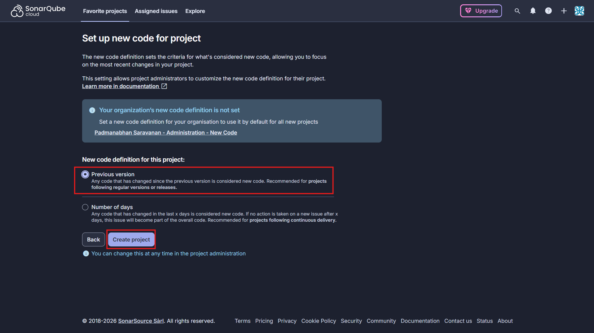
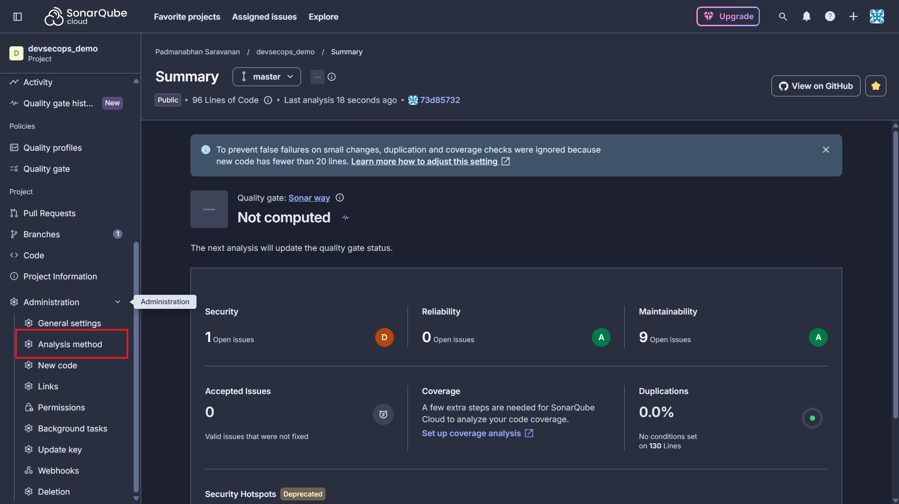
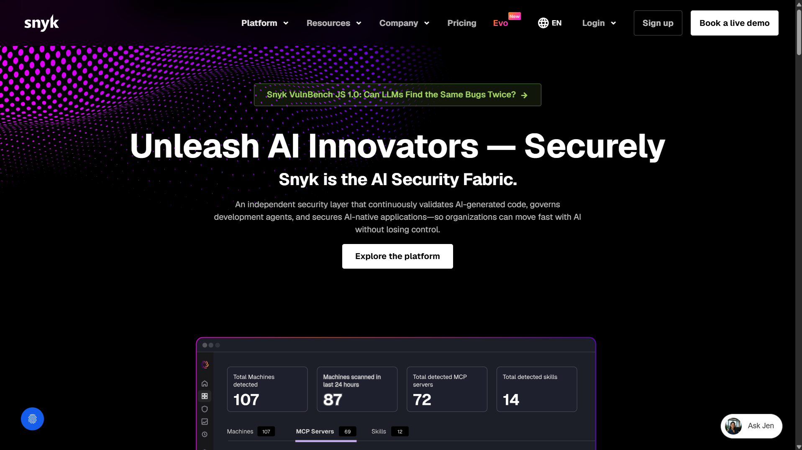
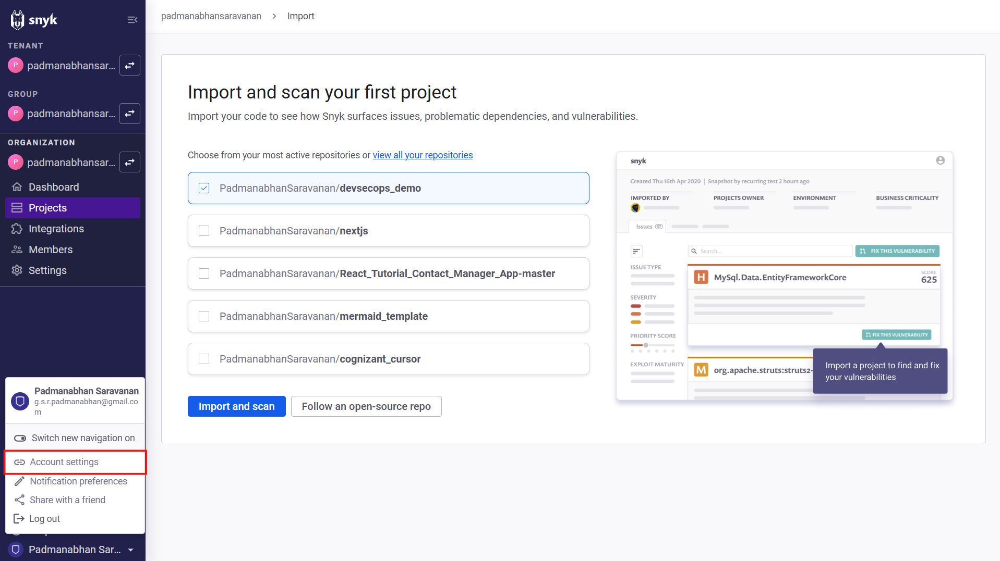
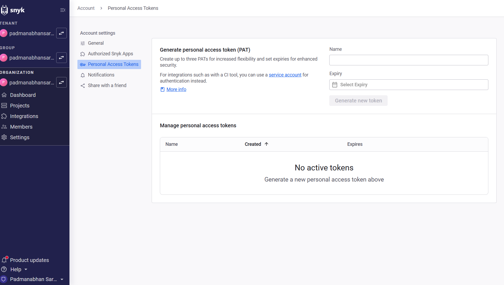
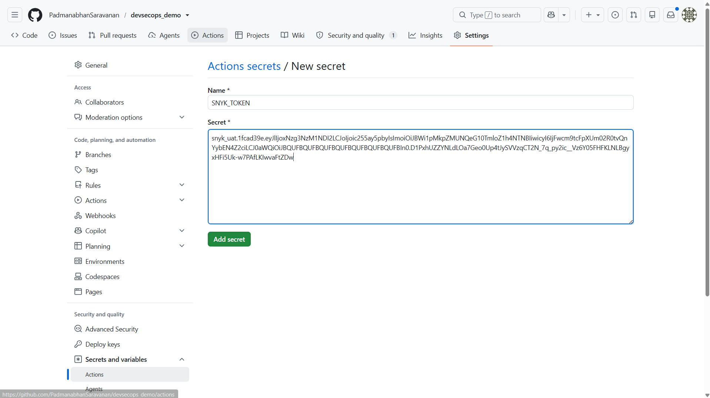
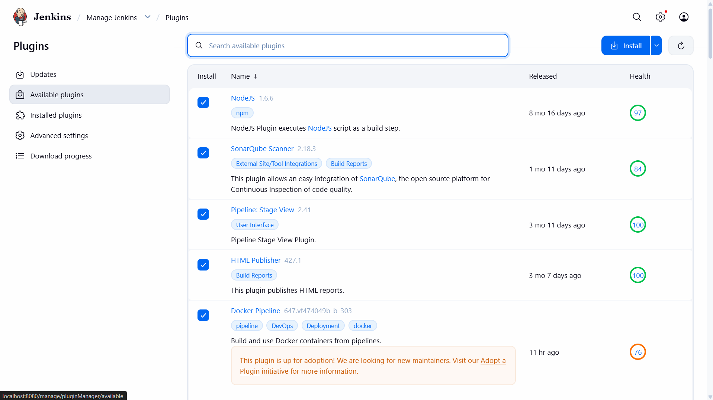
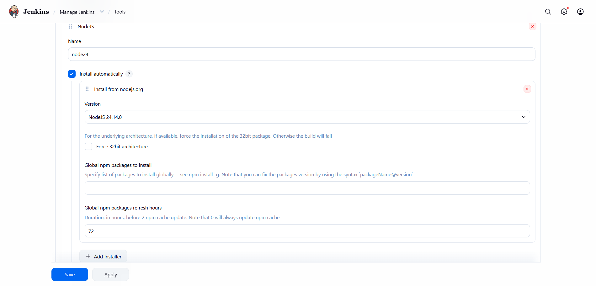
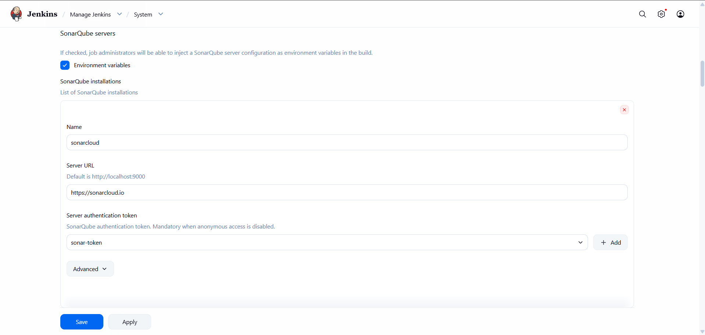

# SonarQube (SonarCloud) + Snyk + Jenkins Pipeline Setup Guide

The [Jenkinsfile](Jenkinsfile) at the repo root runs the full security pipeline end-to-end against the app itself:

1. **Checkout** → **Install Docker CLI** (if missing) → **Install dependencies** (`npm install`)
2. **SAST** via **SonarQube/SonarCloud** + **Quality Gate**
3. **SCA** via **Snyk**
4. **Build Docker image** → **Container Scan** via **Trivy** → **Run app for DAST** → **DAST** via **OWASP ZAP** against the running container

Each scan stage can act as a quality gate — a critical/high-severity finding stops the pipeline before later stages run. Every gate is **off by default** and controlled by its own build parameter, so the pipeline demonstrates all stages end-to-end unless you explicitly turn a gate on:

| Stage | Build parameter | Gate condition when enabled |
| ----- | ---------------- | ---------------------------- |
| SAST (SonarQube) | `ENFORCE_SONAR_GATE` | SonarCloud Quality Gate status is not `OK`. Configure which severities/conditions fail the gate in your SonarCloud project's **Quality Gate** settings. |
| SCA (Snyk) | `ENFORCE_SNYK_GATE` | `snyk test --severity-threshold=critical` exits non-zero, i.e. any **critical** vulnerability is found. |
| Container Scan (Trivy) | `ENFORCE_TRIVY_GATE` | `trivy image --exit-code 1 --severity CRITICAL` exits non-zero, i.e. any **critical** OS/library vulnerability is found in the built image. |
| DAST (ZAP) | `ENFORCE_ZAP_GATE` | Uses `.zap/rules-strict.tsv` instead of `.zap/rules.tsv`, which maps key High-risk rule IDs (SQLi, XSS, Command Injection, etc.) to `FAIL` instead of `WARN`. Juice Shop is intentionally full of these, so this is the one most likely to fail intentionally when enabled. |

See [4.9 Run the pipeline](#49-run-the-pipeline) for how to set these when starting a build.

You need accounts/tokens for SonarCloud and Snyk before the pipeline can run successfully. Steps below.

---

## Prerequisites: push this project to a Git remote

Jenkins pulls the pipeline from source control. From the project root:

```bash
git init
git add .
git commit -m "Initial commit"
```

Push it to whatever Git remote your Jenkins instance can reach (GitHub, GitLab, Bitbucket, or an internal Git server), e.g.:

```bash
git remote add origin <your-git-remote-url>
git branch -M main
git push -u origin main
```

---

## 1. Set up SonarQube (SonarCloud)

The pipeline uses **SonarCloud** (the SaaS version of SonarQube), not a self-hosted SonarQube server — you can see this from `-Dsonar.host.url=https://sonarcloud.io` in the Jenkinsfile.

1. Go to https://sonarcloud.io click on login and sign in with your account or create a new account.


2. Click **+ (Add)** → **Analyze new project**, and import your repository.


   - Choose the **Analayze New Project** option and select your repository and click on **Set Up**.

   

   

   - Select **Previous Version** and click on **Create Project**.

   

   - On left menu click on **Administration** -> **Analysis Method** and Disable the **Automatic Analysis** option for the project.

   

   

3. Note down / set these two values — they must match the Jenkinsfile:

   - On left menu click on **Project Information** where you can find the **Project Key** and **Organization Key**. These values are used in the Jenkinsfile as `sonar.projectKey` and `sonar.organization` respectively.

   

4. Generate a token

   - On Top right corner click on your profile and select **My Account** → **Access Tokens** → **Generate Tokens**. Give it a name and click on **Generate Token**. Copy the token (you won't be able to see it again).

   

   

   

5. Add the token to Jenkins as a credential (see [4.5 Add Jenkins credentials](#45-add-jenkins-credentials)) with ID `sonar-token` — this is how the Jenkinsfile picks it up via `credentials('sonar-token')`.

---

## 2. Set up Snyk

1. Go to https://snyk.io and sign up, authenticating via GitHub is easiest.



2. Get your API token: click your avatar (bottom-left) → **Account Settings** → **Personal Access Tokens** -> provide name and expiry and select **Generate new token**.






3. Add the token to Jenkins as a credential (see [4.5 Add Jenkins credentials](#45-add-jenkins-credentials)) with ID `snyk-token` — this is how the Jenkinsfile picks it up via `credentials('snyk-token')`.



4. Nothing else is required — the Jenkinsfile's `SCA - Snyk` stage runs `npx snyk auth` + `npx snyk test` against `pom.xml`/`package.json` automatically. Findings are written to `reports/snyk-report.json` but don't fail the build (`|| true`).

---

## 3. ZAP (DAST) — no separate account needed

The Jenkinsfile's `DAST - OWASP ZAP` stage runs the official `ghcr.io/zaproxy/zaproxy:stable` Docker image against the Juice Shop container it just built and started, so no external ZAP account or token is required — only Docker (see [4. Set up Jenkins](#4-set-up-jenkins) prerequisites).

---

## 4. Set up Jenkins

The [Jenkinsfile](Jenkinsfile) at the repo root drives a full local security pipeline: install Docker CLI (if missing) → install deps → SAST (SonarCloud) → Quality Gate → SCA (Snyk) → Docker build → container scan (Trivy) → run container → DAST (ZAP) against that container. It expects a Jenkins **agent with Docker available** (Docker-in-Docker or a Docker-capable node), since it builds and runs images directly.

### 4.1 Install Jenkins via Docker

The Jenkinsfile builds Docker images and runs Docker containers directly (Docker build, ZAP scan), so Jenkins itself needs access to a Docker daemon. Run Jenkins with the host's Docker socket mounted in (Docker-in-Docker via socket sharing):

```bash
docker run -d \
  --name jenkins-server \
  -p 8080:8080 \
  -p 50000:50000 \
  -v /var/run/docker.sock:/var/run/docker.sock \
  -v jenkins_home:/var/jenkins_home \
  -u root \
  --restart=on-failure \
  jenkins/jenkins:lts
```

Command breakdown:

- `-d` — runs the container in the background (detached mode).
- `--name jenkins-server` — assigns a custom, easy-to-remember name to the container.
- `-p 8080:8080` — maps the web dashboard port from the container to the host.
- `-p 50000:50000` — maps the inbound agent communication port.
- `-v /var/run/docker.sock:/var/run/docker.sock` — shares the host's Docker daemon with the container, so pipeline steps like `docker build` / `docker run` (used in the `Build Docker image`, `Run app for DAST`, and `DAST - OWASP ZAP` stages) work from inside Jenkins.
- `-v jenkins_home:/var/jenkins_home` — creates a named volume so Jenkins config, jobs, and credentials survive container restarts/recreation.
- `-u root` — runs the container as root, so the pipeline's `Install Docker CLI` stage (see below) can `apt-get install` and so the `jenkins` user has permission to use the mounted Docker socket. Without this, both fail with permission errors.
- `--restart=on-failure` — restarts the container automatically if it crashes.
- `jenkins/jenkins:lts` — the official, actively maintained LTS image.

The Jenkinsfile's first stage, `Install Docker CLI`, checks whether the `docker` command is already available and, if not, installs the official `docker-ce-cli` package via `apt-get` — this is what actually fixes `docker: not found` errors in the `Build Docker image` / `Run app for DAST` / `DAST - OWASP ZAP` stages. It requires the container to be running as root (see `-u root` above); if it isn't, this stage fails with a permission error.

> Note: running the Jenkins container as root and giving it the host's Docker socket effectively grants it root-equivalent access to the host (a container with socket access can launch privileged containers). This is a common trade-off for local/demo CI setups but is not a hardened production configuration — for production, prefer a dedicated build agent with Docker pre-installed and a non-root user in the `docker` group instead.

Then open http://localhost:8080 and unlock Jenkins:

```bash
docker exec jenkins-server cat /var/jenkins_home/secrets/initialAdminPassword
```

Paste that password into the setup wizard, install the **suggested plugins** (you'll add the extra ones below in 4.3), and create your admin user.

Useful commands while managing this container:

```bash
docker exec -it jenkins-server /bin/bash   # shell into the container
docker logs -f jenkins-server              # stream live Jenkins logs
docker stop jenkins-server                 # stop (data persists in the volume)
docker start jenkins-server                # start it back up
docker restart jenkins-server              # reboot the container
```

### 4.2 Prerequisites on the Jenkins host/agent

- **Jenkins** (controller + at least one agent) installed and reachable — see 4.1 for the Docker-based install.
- The **Docker socket** mounted into the Jenkins container/agent, with the container running as root (`-u root`, see 4.1) — the pipeline's own `Install Docker CLI` stage installs the `docker` CLI itself if it isn't already present, so you don't need to install it manually.
- **Node.js 24** available to Jenkins as a configured tool (the Jenkinsfile requests `nodejs 'node24'`).
- Network access from the agent to `sonarcloud.io`, `snyk.io`, and the Docker registries used by `docker build` / the ZAP image (`ghcr.io/zaproxy/zaproxy:stable`) / the Trivy image (`aquasec/trivy:latest`).

### 4.3 Install required Jenkins plugins

Go to **Manage Jenkins → Plugins → Available plugins** and install:

- **NodeJS** — provides the `tools { nodejs 'node24' }` step.
- **SonarQube Scanner** — provides `withSonarQubeEnv` and the Quality Gate webhook support.
- **Pipeline Stage View** (usually pre-installed) — for the `pipeline { ... }` syntax used by the Jenkinsfile.
- **HTML Publisher** — provides `publishHTML`, used to publish the ZAP DAST report.
- **Docker Pipeline** — if you want to reference Docker via pipeline steps rather than raw `sh 'docker ...'` calls (optional, since the Jenkinsfile shells out to `docker` directly, but useful for credentials/registry integration).
- **Credentials Binding** (usually pre-installed) — required for the `credentials('sonar-token')` / `credentials('snyk-token')` bindings.



### 4.4 Configure the NodeJS tool

1. Go to **Manage Jenkins → Tools → NodeJS installations**.
2. Click **Add NodeJS**, set:
   - Name: `node24` (must match the Jenkinsfile exactly)
   - Version: **NodeJS 24.x** (install automatically, or point to a local install)
3. Save.



### 4.5 Add Jenkins credentials

Go to **Manage Jenkins → Credentials → System → Global credentials → Add Credentials** and create two **Secret text** credentials matching the IDs used in the Jenkinsfile's `environment` block. In the **Add Secret text** form, fill in:

| Form field    | Value for `sonar-token`        | Value for `snyk-token`         |
| ------------- | ------------------------------- | -------------------------------- |
| Scope         | Global (Jenkins, nodes, items, all child items, etc) | Global (Jenkins, nodes, items, all child items, etc) |
| Secret        | The SonarCloud token from step 1.4 | The Snyk token from step 2.2  |
| ID            | `sonar-token`                   | `snyk-token`                    |
| Description   | (optional, e.g. `SonarCloud token`) | (optional, e.g. `Snyk token`) |

Click **Create** after each one. These map to `SONAR_TOKEN` and `SNYK_TOKEN` respectively via `credentials('sonar-token')` / `credentials('snyk-token')` in the Jenkinsfile — no other secret configuration is needed.

### 4.6 Configure the SonarQube server

1. Go to **Manage Jenkins → System → SonarQube servers**.
2. Click **Add SonarQube**, set:

   - Name: `sonarcloud` (must match `withSonarQubeEnv('sonarcloud')` in the Jenkinsfile)
   - Server URL: `https://sonarcloud.io`
   - Server authentication token: select the `sonar-token` credential (added in 4.5) or leave blank if you export the token only via the pipeline's `SONAR_TOKEN` env var.



### 4.7 Create the pipeline job

1. From the Jenkins dashboard, click **New Item**.
2. Enter a name (e.g. `juice-shop-pipeline`), select **Pipeline**, click **OK**.
3. Under **Pipeline**, set **Definition** to **Pipeline script from SCM**.
4. Set **SCM** to **Git**, enter your repository URL, and credentials if the repo is private.
5. Set **Script Path** to `Jenkinsfile` (the default, matches this repo's root file).
6. Save.

### 4.8 Points to double-check before the first run

- Tool name `node24`, SonarQube server name `sonarcloud`, and credential IDs `sonar-token` / `snyk-token` must match the Jenkinsfile **exactly** — these are hardcoded, not parameterized.
- The agent running the job needs permission to run `docker build`, `docker run`, and `docker rm` without a password prompt.
- Ports: the pipeline maps container port `3000` to host port `3000` (`APP_PORT`) — make sure that port is free on the agent, or update `APP_PORT` in the Jenkinsfile if it conflicts with another job.
- `.zap/rules.tsv` and `.zap/rules-strict.tsv` must exist at the repo root (they do, by default) — the DAST stage copies one of them into the report directory before running ZAP, depending on `ENFORCE_ZAP_GATE` (see 4.9).
- The `Quality Gate` stage will wait up to 5 minutes for SonarCloud's webhook; if no webhook is configured (4.6), the stage eventually times out. Whether that (or any failing gate) actually fails the build depends on `ENFORCE_SONAR_GATE` — see 4.9. Configure the webhook regardless, to avoid unnecessary 5-minute waits on every build.

### 4.9 Run the pipeline

- **Manually**: open the job in Jenkins and click **Build Now** (uses all parameter defaults — every gate off), or **Build with Parameters** to toggle individual gates on.
- **On every push**: enable your SCM's push-trigger integration (e.g. a repository webhook pointing at `<your-jenkins-url>/github-webhook/` for GitHub, or the equivalent for GitLab/Bitbucket), or configure **Poll SCM** with a schedule. Parameterized triggers use each parameter's default value (all gates default to `false`).

**Build parameters** — each defaults to `false`, meaning the corresponding scan stage always completes and its report is always published, but never fails the build on its own. Set a parameter to `true` (via **Build with Parameters**) to make that specific stage's critical/high-severity findings abort the pipeline:

- **`ENFORCE_SONAR_GATE`** — aborts the pipeline if the SonarCloud Quality Gate status is not `OK`.
- **`ENFORCE_SNYK_GATE`** — aborts the pipeline if Snyk finds any critical vulnerability.
- **`ENFORCE_TRIVY_GATE`** — aborts the pipeline if Trivy finds any critical vulnerability in the built image.
- **`ENFORCE_ZAP_GATE`** — switches the DAST stage from `.zap/rules.tsv` (High-risk = `WARN`) to `.zap/rules-strict.tsv` (High-risk = `FAIL`), so a High-risk ZAP alert aborts the pipeline. Juice Shop is intentionally full of these (SQL Injection, XSS, etc.), so this is the gate most likely to fail when enabled — that's expected, and demonstrates the strict-gate behavior working as intended.

To demonstrate a gate blocking the pipeline: click **Build with Parameters** on the job, set the relevant `ENFORCE_*` parameter to `true`, then **Build**.

Watch progress under the job's **Stage View**; reports are available as build **Artifacts** (`reports/snyk-report.json`, `reports/trivy-report.json`, `reports/zap-report.*`) and under **ZAP DAST Report** in the job's sidebar once `publishHTML` runs.

---